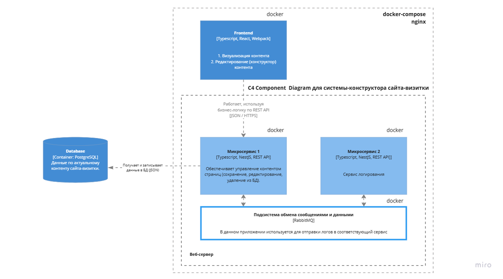
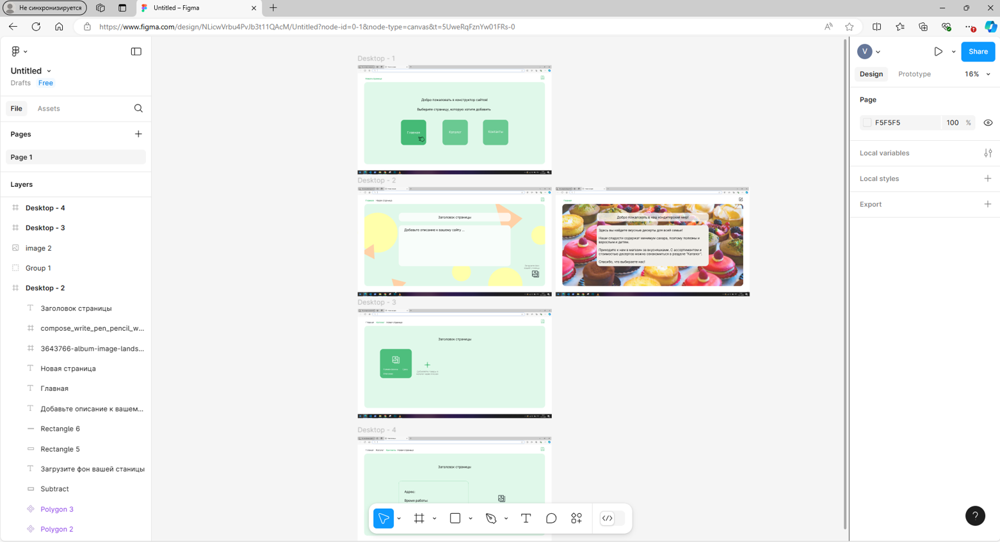

## Проект реализует конструктор сайтов-визиток (cms проект).

### 1. Архитектура:
Микросервисная. Дополнительно реализована система обмена сообщениями (RabbitMQ)

### 2. Макет интерфейса реализован в Figma:
  

### 3. Основные паттерны: 
Одиночка, фабрика, декоратор. Использование  IoC (DI) было реализовано средствами NestJS

### 4. Технологический стек

#### - Frontend: Typescripts, React, Webpack, Docker 
#### - Backend: Typescript, NestJS, Jest, Docker
#### - Дополнительно: RabbitMQ 
#### - Инфраструктура: Docker-compose 

### 5. Для запуска проекта необходимо в корне набрать команду 
#### docker-compose up --build